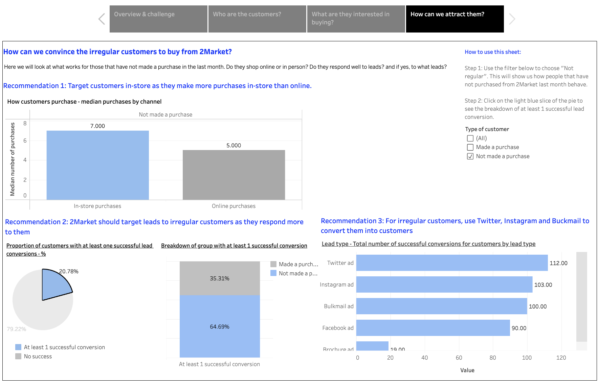
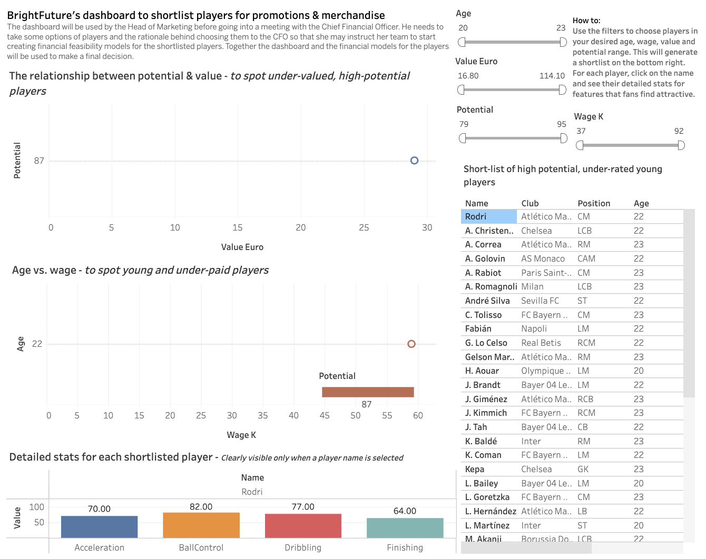

# Tableau-practice
Here are some dashboards made to practice Tableau skills during my London School of Economics Data Analytics course

### Market Analysis for a retailer with both in-store and online purchases

Full tableau dashboard can be found [here](https://public.tableau.com/shared/RT9SW4397?:display_count=n&:origin=viz_share_link)

### Dashboard for discovering interesting footballer sponsorship opportunities

Full tableau dashboard can be found [here](https://public.tableau.com/views/Football_analysis_17535552692390/Dashboard1?:language=en-GB&:sid=&:redirect=auth&:display_count=n&:origin=viz_share_link)
